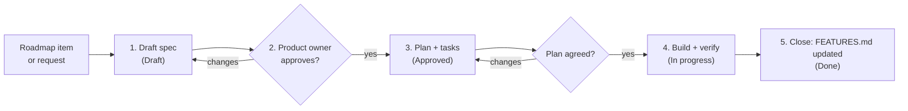

# Spec-driven development

Vortex is built spec-first from 8 October 2026. A feature or a change in behaviour starts as a written spec in [`specs/`](../specs/), the product owner approves it, and only then is code written. When the work ships, the spec is closed and [`docs/FEATURES.md`](FEATURES.md), the description of the app as built, is updated.

Everything built before 8 October 2026 (versions 1.0.0 to 1.1.10) was built without specs. Specs 001 to 013 were written afterwards from the code, so the history is complete and later specs have something to amend. Their plans say how the code is laid out; their task lists record what verification existed at the time.

Why:

- **Decisions are made once, in writing.** Scope, rules and edge cases are agreed before the build, not discovered in a review round or reverse-engineered from the code later.
- **The docs stay true.** Specs record what was intended and why; `FEATURES.md` records how the app works now. Both are kept up to date with each change.
- **Work can be handed over.** Anyone, including Claude in a fresh session, can pick up a spec and its task list and carry on. Two sessions can build different specs at once and combine them.

## Roles

| Who | Does |
| --- | --- |
| **Product owner** (Nithin) | Decides what gets built. Approves specs and plans, answers open questions, installs each build and accepts the finished work. |
| **Builder** (Claude, or a developer) | Drafts specs and plans, builds, verifies, and brings the docs up to date. Doesn't write code for a spec that hasn't been approved. |

## What needs a spec

| Change | Spec? |
| --- | --- |
| A new feature, page, Settings card or background job | Yes |
| A change to a rule: how files are grouped, when something counts as watched, what a scan touches, what the rename does, what the engine does in proxy mode | Yes |
| A schema change (new table or column, a changed migration) | Yes |
| A new outside service or library that changes how the app works (a player protocol, a new engine, a new API) | Yes, plus an entry in the [decision log](decisions.md) |
| A bug fix that makes the code do what `FEATURES.md` or the spec already says | No. Fix it and note it in the commit |
| A bug fix where the documented behaviour itself was wrong | Yes: a small spec, or an amendment to the spec it came from |
| Copy, spacing or colour tweaks within the design | No |
| Refactoring with no change in behaviour, dependency bumps, docs-only changes | No, but update anything in `FEATURES.md` it makes wrong |

When in doubt, write a short spec. A one-page spec takes minutes to write and approve.

## The pieces

| Where | What it is | Changes when |
| --- | --- | --- |
| [`docs/principles.md`](principles.md) | The rules every change respects | Rarely, by decision |
| [`docs/roadmap.md`](roadmap.md) | The backlog: done, pending, parked | An item is picked up, ships, or is reprioritised |
| `specs/NNN-name/spec.md` | **What and why**: the problem, requirements, acceptance criteria | Written first, approved, then only amended with approval |
| `specs/NNN-name/plan.md` | **How**: data, code, UI, risks | After the spec is approved |
| `specs/NNN-name/tasks.md` | **Steps**: an ordered checklist, ticked off while building, with the verification record | During the build |
| [`docs/FEATURES.md`](FEATURES.md) | **How the app works now** (as built), by area | When a spec ships |
| [`docs/decisions.md`](decisions.md) | Lasting technical and product decisions, with the reason | A spec makes a decision that outlives it |

Templates are in [`specs/_template/`](../specs/_template/). Specs are numbered in order with a short kebab-case name (`specs/017-watch-later/`). Numbers are never reused; the [spec index](../specs/README.md) lists them all.

## The flow

### 1. Draft the spec

Copy `specs/_template/spec.md` into a new numbered folder and fill it in. A good spec:

- starts from the **problem and who has it**, not from the solution;
- lists **requirements** as numbered, testable statements (`FR-1`, `FR-2`, …), grouped by where they show up (a page, Settings, the tray, a background job) when there is more than one place;
- says **where it lives**: which page or card, what runs in the background, which events the UI reacts to;
- covers **edge cases** where they matter: an offline drive, a renamed or moved file, a title with no TMDb match, no player configured, no TMDb key, an empty library, hundreds of titles, light and dark theme, the 1100 × 720 default window;
- gives **acceptance criteria** (`AC-1`, …) that someone can check in the running app, each tied to the requirements it proves;
- lists **non-goals**, so the scope is clear, and **open questions** for the product owner;
- checks itself against the [principles](principles.md) and says if it needs an exception.

The spec describes behaviour, not code. Table, file and function names belong in the plan.

### 2. Approve the spec (gate 1)

The product owner reads the spec, answers the open questions, and either asks for changes or approves it. Approval is recorded in the spec's header (`Status: Approved`, with the date). **No code is written before this point.** Small specs can be approved together with their plan in one step. The product owner may also say up front that a batch of specs needs no approval step; then the builder records "Approved (date, product owner's standing instruction)".

### 3. Plan and tasks

With the spec approved, write `plan.md` from the template: which `FEATURES.md` sections change, schema changes and the migration (an ignored `ALTER TABLE` in `db::open`), the Rust modules and commands, the events the UI listens to, the Vue views and components, settings keys, risks. Then break the plan into `tasks.md`: small ordered steps, each naming the requirements it serves, ending with verification and the doc updates.

If the plan turns up something the spec got wrong or left out, go back and amend the spec before building.

### 4. Build and verify

Work through `tasks.md` in order and tick tasks off as they're done. Set the spec's status to **In progress**.

Verify every acceptance criterion before calling the work done:

- `cd src-tauri && cargo test -j 1` passes (`-j 2` has crashed rustc when memory was short), and `pnpm build` (which runs `vue-tsc --noEmit`) passes.
- Each acceptance criterion is checked in the running app (`pnpm tauri dev`, or the installed build) against a real library, in light and dark where the UI changed. Record how each one was checked in the Verification section of `tasks.md`.
- Rules in Rust (parsing, grouping, renaming, placement, the status machines) get a unit test next to the existing ones.
- A release build (`CARGO_BUILD_JOBS=2 pnpm tauri build`) is made only when nothing else is compiling, and its installer timestamps are checked before the paths are handed over. The product owner installs and tests it; installers are never published to GitHub.

### 5. Close

A spec is done when:

- every task is ticked and every acceptance criterion verified;
- **`docs/FEATURES.md`** describes the new behaviour as built, and anything the spec changed there is corrected (including the Known gaps section);
- the **README** is updated if the feature list, setup or stack changed;
- the **roadmap** moves the item to Done with a one-line summary and a link to the spec;
- any lasting decision is added to the **decision log**;
- the spec header says `Status: Done`, with the date and the commit.

The spec is then history. `FEATURES.md` is the description of the app as it is now.

## Changing an approved spec

- **Clarifications** that don't change scope: edit the spec and add a Changelog line.
- **Scope or rule changes**: edit the spec, add a Changelog line, and get the product owner's approval again before building that part.
- **Abandoned work**: `Status: Dropped` with a sentence on why; leave the folder in place.
- **Replaced by a later spec**: `Status: Superseded by NNN`.

## When the code and the docs disagree

- If the code doesn't do what an approved spec or `FEATURES.md` says, it's a **bug**: fix the code.
- If the doc is wrong, fix the doc: as part of a spec when it changes behaviour, or directly when it's only a description error.
- Never leave them disagreeing. A commit that changes behaviour without touching a spec or `FEATURES.md` is incomplete.

## Commits and sessions

- Reference the spec in commit messages: `Spec 014: sync button and job status`.
- Commit the spec (Draft or Approved) before the code, so the history shows the decision first.
- Several Claude sessions may build different specs in the same checkout. Each stays inside its spec's files; the one that finishes last reconciles `FEATURES.md`, the roadmap and the index. Only one `cargo`/`pnpm tauri build` runs at a time on the build machine (see `AGENTS.md`).

## Working with Claude

Three project skills in `.claude/skills/` run the steps:

| Command | Does |
| --- | --- |
| `/spec <idea or roadmap item>` | Drafts a new spec (or amends one), asks the open questions, then stops for approval |
| `/spec-plan <spec number>` | Writes `plan.md` and `tasks.md` for an approved spec, then stops for agreement |
| `/spec-build <spec number>` | Builds from `tasks.md`, verifies each acceptance criterion, and closes the spec with the doc updates |

`AGENTS.md` at the repository root holds the same rules in short form; `CLAUDE.md` imports it.
